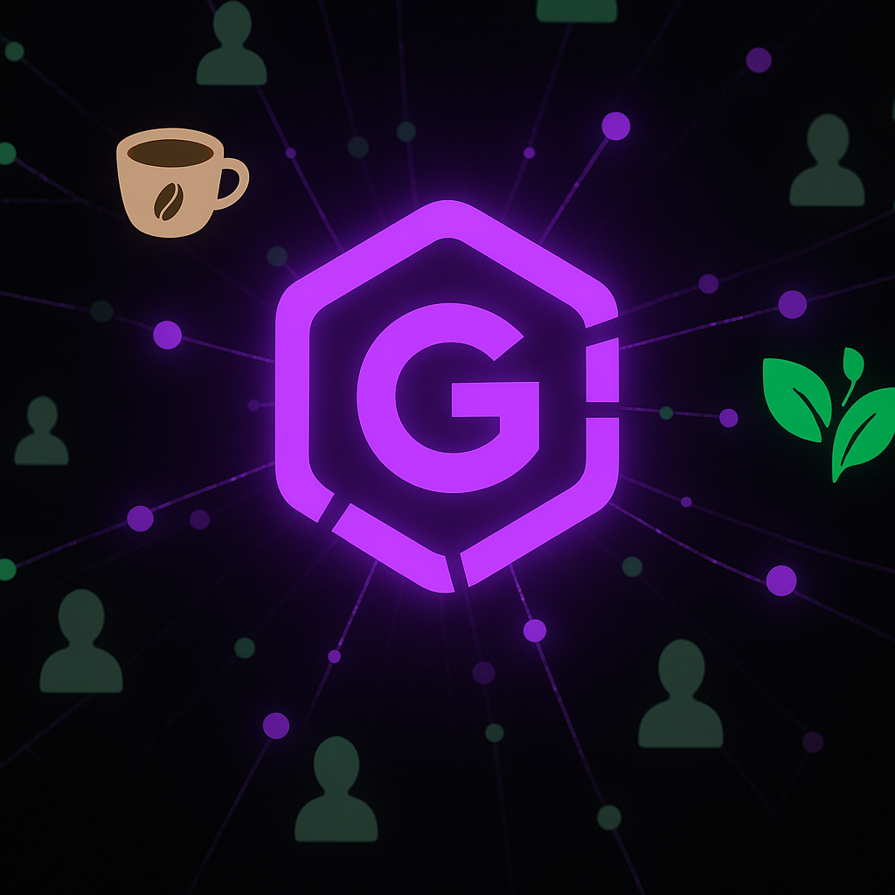
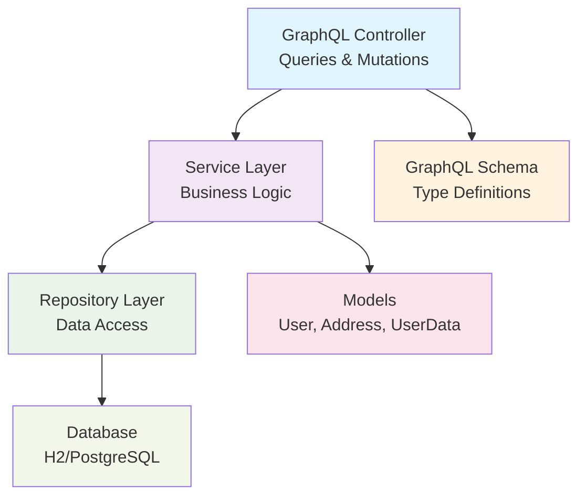

# GraphQL User Management API

> A modern GraphQL API service built with Spring Boot for comprehensive user management



## 📋 Table of Contents

-   [About the Project](#-about-the-project)
-   [Features](#-features)
-   [Technologies Used](#-technologies-used)
-   [Architecture](#-architecture)
-   [Prerequisites](#-prerequisites)
-   [Installation and Setup](#-installation-and-setup)
-   [GraphQL Schema](#-graphql-schema)
-   [Usage Examples](#-usage-examples)
-   [Project Structure](#-project-structure)
-   [Configuration](#-configuration)
-   [Contributing](#-contributing)
-   [License](#-license)

## 🎯 About the Project

**GraphQL User Management API** is a Java application built on Spring Boot that provides a complete user management system through GraphQL. The project was developed by BortolettoTech, demonstrating best development practices with modern GraphQL technologies and Spring Boot.

### Why use this service?

-   ✅ **GraphQL Power**: Single endpoint with flexible data fetching
-   ✅ **Type Safety**: Strongly typed schema with validation
-   ✅ **User Management**: Complete CRUD operations for users and addresses
-   ✅ **Role-based Access**: User roles (USER, PILOT, ADMIN) management
-   ✅ **Modern Architecture**: Clean architecture with Spring Boot
-   ✅ **Database Flexibility**: Support for H2 (development) and PostgreSQL (production)

## 🚀 Features

### Core Features

-   **User Management**: Create, read, update users with comprehensive data
-   **Address Management**: Handle user addresses with full CRUD operations
-   **Role Management**: Support for different user roles (USER, PILOT, ADMIN)
-   **GraphQL Queries**: Flexible data fetching with single endpoint
-   **GraphQL Mutations**: Create and update operations through mutations
-   **Type Safety**: Strongly typed GraphQL schema

### Advanced Features

-   **Exception Handling**: Comprehensive GraphQL error handling
-   **Data Validation**: Input validation for all operations
-   **Repository Pattern**: Clean data access layer
-   **Service Layer**: Business logic separation
-   **Spring Integration**: Full Spring Boot ecosystem integration

## 🛠 Technologies Used

### Backend

-   **Java 17** - Programming language
-   **Spring Boot 3.5.3** - Main framework
-   **Spring for GraphQL** - GraphQL integration
-   **Spring Web** - Web layer

### Database

-   **H2 Database** - In-memory database (development)
-   **PostgreSQL** - Production database (optional)

### Tools

-   **Maven** - Dependency management
-   **Lombok** - Boilerplate reduction
-   **GraphQL Java** - GraphQL implementation

### Code Quality

-   **JUnit** - Unit testing
-   **Spring Boot Test** - Integration testing

## 🏗 Architecture



### Data Flow

1. **GraphQL Request**: Client sends GraphQL query/mutation
2. **Schema Validation**: GraphQL validates against schema
3. **Controller Processing**: Spring GraphQL controller handles request
4. **Service Logic**: Business logic processing in service layer
5. **Data Access**: Repository layer manages database operations
6. **Response**: GraphQL formatted response returned

## 📋 Prerequisites

Before you begin, make sure you have installed:

-   **Java 17+** ([Download](https://adoptium.net/))
-   **Maven 3.6+** ([Download](https://maven.apache.org/download.cgi))
-   **Git** ([Download](https://git-scm.com/downloads))

## 🚀 Installation and Setup

### 1. Clone the Repository

```bash
git clone https://github.com/bortolettojoaog/graphql-user-management.git
cd graphql-user-management
```

### 2. Run the Application

```bash
# Compile and run
./mvnw spring-boot:run

# Or on Windows
mvnw.cmd spring-boot:run
```

### 3. Verify the Setup

The application will be available at:

-   **GraphQL Endpoint**: `http://localhost:8080/graphql`
-   **GraphiQL Interface**: `http://localhost:8080/graphiql` (if enabled)

## 📡 GraphQL Schema

### Base URL

```
http://localhost:8080/graphql
```

### GraphQL Schema Definition

```graphql
type Query {
    users: [User]
    user(id: String!): User
    usersByRole(role: RoleEnum!): [User]
}

type Mutation {
    createUser(userData: UserDataInput!): User
    updateUser(id: String!, userData: UserDataInput!): User
}

type User {
    id: String!
    name: String!
    email: String!
    role: RoleEnum!
    addresses: [Address]
}

type Address {
    id: String!
    street: String!
    city: String!
    state: String!
    zipCode: String!
}

enum RoleEnum {
    USER
    PILOT
    ADMIN
}

input UserDataInput {
    name: String!
    email: String!
    role: RoleEnum!
}
```

### Available Operations

#### 1. Query All Users

```graphql
query {
    users {
        id
        name
        email
        role
        addresses {
            id
            street
            city
            state
            zipCode
        }
    }
}
```

#### 2. Query User by ID

```graphql
query {
    user(id: "user123") {
        id
        name
        email
        role
    }
}
```

#### 3. Query Users by Role

```graphql
query {
    usersByRole(role: PILOT) {
        id
        name
        email
        role
    }
}
```

#### 4. Create User

```graphql
mutation {
    createUser(
        userData: { name: "John Doe", email: "john@example.com", role: USER }
    ) {
        id
        name
        email
        role
    }
}
```

#### 5. Update User

```graphql
mutation {
    updateUser(
        id: "user123"
        userData: {
            name: "John Smith"
            email: "johnsmith@example.com"
            role: ADMIN
        }
    ) {
        id
        name
        email
        role
    }
}
```

## 💡 Usage Examples

### Using GraphiQL (Recommended)

Access `http://localhost:8080/graphiql` in your browser for an interactive GraphQL IDE.

### Using cURL

#### Query all users:

```bash
curl -X POST http://localhost:8080/graphql \
  -H "Content-Type: application/json" \
  -d '{
    "query": "{ users { id name email role } }"
  }'
```

#### Create a new user:

```bash
curl -X POST http://localhost:8080/graphql \
  -H "Content-Type: application/json" \
  -d '{
    "query": "mutation { createUser(userData: { name: \"Alice Johnson\", email: \"alice@example.com\", role: USER }) { id name email role } }"
  }'
```

#### Query user by ID:

```bash
curl -X POST http://localhost:8080/graphql \
  -H "Content-Type: application/json" \
  -d '{
    "query": "{ user(id: \"user123\") { id name email role addresses { street city } } }"
  }'
```

### Using JavaScript/Fetch

```javascript
// Query all users
const queryUsers = async () => {
    const response = await fetch('http://localhost:8080/graphql', {
        method: 'POST',
        headers: {
            'Content-Type': 'application/json',
        },
        body: JSON.stringify({
            query: `
        query {
          users {
            id
            name
            email
            role
            addresses {
              street
              city
              state
            }
          }
        }
      `,
        }),
    });

    const result = await response.json();
    console.log('Users:', result.data.users);
};

// Create a new user
const createUser = async () => {
    const response = await fetch('http://localhost:8080/graphql', {
        method: 'POST',
        headers: {
            'Content-Type': 'application/json',
        },
        body: JSON.stringify({
            query: `
        mutation CreateUser($userData: UserDataInput!) {
          createUser(userData: $userData) {
            id
            name
            email
            role
          }
        }
      `,
            variables: {
                userData: {
                    name: 'Bob Wilson',
                    email: 'bob@example.com',
                    role: 'PILOT',
                },
            },
        }),
    });

    const result = await response.json();
    console.log('Created user:', result.data.createUser);
};
```

## 📁 Project Structure

```
src/
├── main/
│   ├── java/com/bortolettotech/graphql/
│   │   ├── GraphqlApplication.java         # Main class
│   │   ├── controller/
│   │   │   └── UserController.java         # GraphQL resolvers
│   │   ├── handler/
│   │   │   └── GraphQLExceptionHandler.java # Error handling
│   │   ├── model/
│   │   │   ├── User.java                   # User entity
│   │   │   ├── Address.java                # Address entity
│   │   │   └── UserData.java               # User data model
│   │   ├── repository/
│   │   │   ├── UserRepositoryI.java        # Repository interface
│   │   │   └── impl/
│   │   │       └── UserRepositoryImpl.java # Repository implementation
│   │   ├── service/
│   │   │   └── UserService.java            # Business logic
│   │   └── type/
│   │       └── RoleEnum.java               # Role enumeration
│   └── resources/
│       ├── application.properties          # Configuration
│       └── graphql/
│           └── schema.graphqls             # GraphQL schema
└── test/
    └── java/com/bortolettotech/graphql/
        └── GraphqlApplicationTests.java
```

## ⚙️ Configuration

### application.properties

```properties
# Application settings
spring.application.name=graphql
server.port=8080

# GraphQL settings
spring.graphql.graphiql.enabled=true
spring.graphql.graphiql.path=/graphiql

# Database settings (H2 for development)
spring.datasource.url=jdbc:h2:mem:testdb
spring.datasource.driverClassName=org.h2.Driver
spring.datasource.username=sa
spring.datasource.password=

# H2 Console (for development)
spring.h2.console.enabled=true
spring.h2.console.path=/h2-console

# JPA settings
spring.jpa.database-platform=org.hibernate.dialect.H2Dialect
spring.jpa.hibernate.ddl-auto=create-drop
spring.jpa.show-sql=true
```

### Environment Variables

You can override the configurations using environment variables:

```bash
export SERVER_PORT=8080
export SPRING_DATASOURCE_URL=jdbc:postgresql://localhost:5432/graphql_db
export SPRING_DATASOURCE_USERNAME=your_username
export SPRING_DATASOURCE_PASSWORD=your_password
```

### Production Configuration (PostgreSQL)

For production, update your `application-prod.properties`:

```properties
# PostgreSQL settings
spring.datasource.url=jdbc:postgresql://localhost:5432/graphql_db
spring.datasource.username=${DB_USERNAME:postgres}
spring.datasource.password=${DB_PASSWORD:password}
spring.jpa.database-platform=org.hibernate.dialect.PostgreSQLDialect
spring.jpa.hibernate.ddl-auto=validate

# Disable H2 console in production
spring.h2.console.enabled=false
```

## 🤝 Contributing

Contributions are welcome! To contribute:

1. Fork the project
2. Create a branch for your feature (`git checkout -b feature/new-feature`)
3. Commit your changes (`git commit -m 'Add new feature'`)
4. Push to the branch (`git push origin feature/new-feature`)
5. Open a Pull Request

### Development Standards

-   Use Java naming conventions
-   Add tests for new features
-   Keep code documented
-   Follow Spring Boot and GraphQL best practices
-   Ensure GraphQL schema is properly documented

## 📄 License

This project is under the MIT license. See the [LICENSE](LICENSE) file for more details.

---

<div align="center">
  <p>Developed with ❤️ by <strong>BortolettoTech</strong></p>
  <p>⭐ If this project was helpful, consider giving it a star!</p>
</div>
